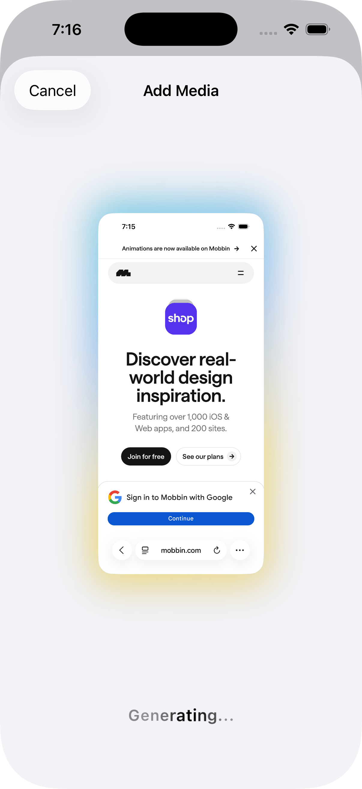

# InspoFlow 🌊
**Capture. Analyze. Organize.**

InspoFlow is a native iOS application designed for designers, developers, and creatives who live in their screenshots. It transforms your messy camera roll into a curated, searchable timeline of inspiration, powered by AI.

  

## ✨ Key Features

*   **智能 Screenshot Ingestion**: Automatically detects screenshots and organizes them into a dedicated feed.
*   **AI-Powered Analysis**: Uses **Vision LLMs** (via Hugging Face) to scan images, generating smart summaries, categorizing content, and extracting tags automatically.
*   **Cloud Persistence**: All your inspirations are synced to **Supabase**, ensuring your collection is safe and accessible.
*   **Beautiful UI**: A clean, minimalist interface inspired by Savee and Pinterest, designed for maximum focus on content.
*   **Dynamic Aesthetics**: Fluid animations and a premium look and feel that adapts to your system's light/dark mode.

## 📸 Screenshots

| Homescreen | Ingestion Flow | Analysis |
|:---:|:---:|:---:|
|  |  |  |

## 🛠 Tech Stack

*   **Language**: Swift 5.10
*   **UI Framework**: SwiftUI (NavigationStack, MeshGradient)
*   **Backend**: Supabase (Database & Storage)
*   **AI Engine**: Hugging Face Inference API (Qwen/VL Models)
*   **Local Cache**: SwiftData

## 🚀 How to Install

1.  Clone this repository.
2.  Open `InspoFlow.xcodeproj` in Xcode.
3.  Configure your API keys in `Services/SupabaseConfig.swift` and `Services/HuggingFaceConfig.swift`.
4.  Change the **Signing Team** to your personal Apple ID.
5.  Plug in your iPhone and hit **Run**.

## 🤝 Contributing
InspoFlow is open source! Feel free to fork the repo, create a feature branch, and submit a Pull Request.

1.  Fork the Project
2.  Create your Feature Branch (`git checkout -b feature/AmazingFeature`)
3.  Commit your Changes (`git commit -m 'Add some AmazingFeature'`)
4.  Push to the Branch (`git push origin feature/AmazingFeature`)
5.  Open a Pull Request

## 📄 License
Distributed under the MIT License. See `LICENSE` for more information.
